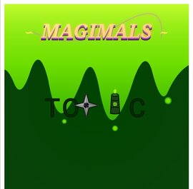

# Magimals Toxic


## 👀 Media
### Songs
Downloadable
[here](https://github.com/WebDesignerCameron/src/blob/main/projects/magimals-toxic/assets/Music/)
in mp3, m4a, wav, and ogg format, and
[here](https://github.com/WebDesignerCameron/src/blob/main/projects/magimals-toxic/assets/Videos/novisual)
in mp4 format. 
### Logo

## 🔃 Summary
This is the official Magimals Toxic 
website. Magimals Toxic is a fanmade
Pokemon game, but not associated 
with Nintendo at all. Magimals Toxic, 
a WebDesignerCameron Project, was
created by
[WebDesignerCameron](https://github.com/WebDesignerCameron)
and the other contributors listed
[here](contributors.md). 

*Disclaimer: Magimals Toxic is a
non-profit, fan-made project. It is 
inspired by the Pokémon franchise but 
is not affiliated with, endorsed by, 
or associated with Nintendo, Game 
Freak, or The Pokémon Company.*
## 🔨 Made with


 
## 🔗 Links
* [Main Website](https://webdesignercameron.github.io/magimals-toxic)
* [Contributors](https://github.com/WebDesignerCameron/magimals-toxic/blob/main/contributors.md)
* [Get your own brilliant website](https://webdesignercameron.github.io/WebDesignerCameronSites)
* [See WebDesignerCameron](https://github.com/WebDesignerCameron)
* [Copyright Clarifications](https://github.com/WebDesignerCameron/magimals-toxic/blob/main/clarifications.md)
* [Folders](https://github.com/WebDesignerCameron/magimals-toxic/blob/main/src/src.md)
* [License](https://github.com/WebDesignerCameron/magimals-toxic/blob/main/LICENSE.md)
* [Programming](https://webdesignercameron.github.io/magimals-toxic/program.html)
* [Privacy Policy](PRIVACY.md)
* [Record of changes](CHANGELOG.md)
* [Source code](src/sourcecode.md) 
## 🎮 Game Introduction
Magimals Toxic is a wild game of tactics 
and strategy as you advance through the 
carefully calibrated and planned map, 
where you fight trainers in your epic 
journey to the Oscilla Mountains. 
Magimals Toxic can get your blood pumping 
in a fast-paced adventure, or you can 
take the slow road and eventually work 
your way through the detailed plot twists 
and breath-taking adventures that you 
will ahead of you. 
## 🧑‍💻 Running Magimals Toxic
Since Beta 1.0 isn't released, you
can only see the website, linked
[here](https://webdesignercameron.github.io/magimals-toxic). You can also see
the website differently, see below.

## 🚀 Quick Start & Local Run

Because the game is entirely client-side, you can host or play it instantly without a heavy local environment.

### Run Locally
1. Clone the project to your local machine:
   ```bash
   git clone https://github.com/WebDesignerCameron/magimals-toxic
   ```
2. Navigate into the directory:
   ```bash
   cd magimals-toxic
   ```
3. Open `index.html` directly in any modern web browser, or use a basic development server:
   ```bash
   # If you use VS Code, use the Live Server extension, or run:
   npx serve .
   ```
## 🏗️ Game Architecture
### Codebase Constraints
* **Pure Vanilla Stack:** Built completely using standard HTML5 Canvas, CSS grid layouts, and native ES6+ JavaScript.
* **Zero Dependencies:** No heavy external frameworks or bulky engines to ensure lightning-fast browser load times. 
## 📈 GitHub Stats

Type:            Repository         

Latest Release:  N/A

Game Version:    Prerelease

PRs:             7

Merged PRs:      6

Closed PRs:      7

Branches:        2

Ongoing PRs:     1

<!-- COMMIT_COUNT_START --> Total Commits: 264 <!-- COMMIT_COUNT_END -->
(updated daily, may not be accurate) 

## ⚒️ Working on

✅ Game Grid Setup

⬜ Game Design

⬜ Graphics

⬜ Beta 1.0

## 💯 Features
### Notice
🚦 Magimals Toxic is still in 
development. Features may change, 
but the overall theme will stay the
same. 
### Summary
* [ ] A **massive** map with many details
* [ ] A **wide variety** of creatures to catch
* [ ] A **thrilling** adventure awaiting anyone who steps into the dark world of ***Magimals Toxic***...
* [ ] **Status Conditions:** Integrating "Toxic" type mechanics like poison scaling and damage-over-time status effects during battles.
### Maps
The maps of the 4 ferocious islands
contain routes, paths, shores, and
cities, giving you a large
area to explore. Maps may
change over the course of
development, but key premises will
remain.
### Creatures
Many creatures will be there to be
collected, with over 100 planned
to be in the game. Each
Magimal was masterly crafted
by the Concept Production Team,
every one of them having a
unique set of skills and
quirks.
### Adventure
Each breath-taking moment
hardwires a resonating sense of
accomplishment in the player,
making a pleasant experience
for anyone lucky enough to
encounter the game. A rewarding 
level of progression spurs you
on to achieve higher, and when
you do, happiness rains down on
you. The game is a truly satisfying
experience. 
### Gameplay
* Turn-based battles
* Unique Magimal abilities
* Exploration-focused maps
* Story-driven progression
## 👋 Contributing
To contribute, see our
[contributing guidelines](CONTRIBUTING.md). 
## 🦖 Backstory
Many millenia ago, creatures known
as the ancient Magimals roamed the
Earth, seeking a higher power they
could exploit. A tragic family's
descendants are the humans and the
Magimals known today. 
## 🌎 World
### Summary
You travel through 4 completely
different islands to venture
to the final fight. The fight
against ***Magmor...***
### Gems
To progress, you must collect the
3 gems of power from various islands, 
giving you an ability the ancient
Magimals could only dream of. 
### Starter Island
You start out as an adventurous kid
who lives in Hometon, Starter Island,
a nice little village surrounded by
thick forests, suited for a good
adventure.
### Granite Island
After collecting the Fire Gem from
Starter Island, you row your boat
to Granite Island, a grassy plateau
of interesting inhabitants. There
you collect the Grass Gem.
### Montacia Island
You move along to Montacia Island,
a mountainous location highlighted
by its great Oscilla Mountains.
You obtain the Water Gem.
### Final Island
In a swift turn of events, you
arrive at the dreaded Final Island,
a fiery tomb of chaos and
unorder. What lies there haunts
many, an unforseen **horror**... 

## 🧪 Deep-Dive Gameplay Mechanics

The gameplay of Magimals Toxic relies 
on tight loops, deterministic 
calculations, and risk-versus-reward 
tactical choices. 

### Grid-Based Navigation Matrix
The game world is represented as a 
structural 2D coordinate array. 
* **Safe Pathways:** Clear pathways allow for unhindered movement and zero encounter risks.
* **Tall Grass / Other Encounters:** Stepping onto these specific tiles triggers a probability-based encounter matrix. You are sent into a battle scene.
* **Static Obstacles:** Map blockades require specific key items or victory conditions to clear, pacing your progression naturally through the narrative.

### Turn-Based Combat Logic
When a battle begins, the game state 
switches from navigation mode to an 
isolated active combat loop. Turn 
order is entirely calculated by a 
hidden Speed stat tier, forcing 
players to balance raw power against
agility:
1. **Action Phase:** Choose between Attack, Special Move, Item Inventory, or Attempt Escape.
2. **Execution Phase:** Damage is computed using a custom formula that weighs the attacker's offensive rating against the defender's damage mitigation modifier.
3. **Status Check:** At the end of every turn, active status effects (such as the signature escalating Poison drain) are applied before handing control back to the player.

## 🛠️ Technical Architecture

Magimals Toxic is engineered to run 
seamlessly across all modern web 
browsers by leveraging lightweight, 
bare-metal web standards. By rejecting 
bulky modern frameworks, the game 
loads instantaneously and maintains a 
flawless rendering rate even on 
lower-end mobile hardware.

### The Three-Pillar Stack
* **Markup (HTML5):** Utilizes semantic elements and a high-performance `<canvas>` rendering context to handle real-time sprite updates and fluid screen transitions.
* **Styling (CSS3):** Employs CSS Grid and Flexbox modules to ensure a perfectly responsive user interface that auto-scales smoothly between desktop monitors and smartphone displays.
* **Logic (ES6+ JavaScript):** Written entirely in modular object-oriented JavaScript. The architecture splits the core engine into explicit modules for the Game Loop, Input Listener, Combat State Machine, and Audio Controller.

### State Management & Persistence
The game state is preserved entirely 
within the user's browser using native 
`localStorage` integrations. When you 
save your game, your active party 
arrays, coordinate positions, and 
completed trainer flags are serialized 
into a clean JSON string, allowing you 
to close your browser and resume your 
journey at any time without losing a 
single step of progress.

## ❓ Frequently Asked Questions (FAQ)

#### Q: Can I run this game completely offline?
**A:** Yes! Because the entire 
codebase runs client-side in the 
browser, you can clone the repository 
and open `index.html` to play the full 
game without an active internet 
connection. Though, you will also have
to clone the `src` repository with
```bash
git clone https://github.com/WebDesignerCameron/src
```
and save the source files. 

#### Q: How do I reset my saved game file?
**A:** To clear your local save and 
start your journey fresh, open your 
browser's Developer Tools (F12), 
navigate to the Application/Storage 
tab, select `localStorage`, and clear 
the keys associated with the 
repository domain. Alternatively, you 
can click the in-game "New Game" 
button if available in your current 
build version.

#### Q: Is there a limit to how many Magimals I can catch?
**A:** The base engine supports a 
dynamic array structure for your party 
storage, meaning there is no strict 
hard-coded limit to the number of 
creatures you can collect. Your active 
battle team, however, is strictly 
capped at a tactical size of six.

#### Q: Why is my game lagging on an older browser version?
**A:** Magimals Toxic utilizes modern 
JavaScript features like arrow 
functions, classes, and spread 
operators. If you experience 
unexpected script freezes, please 
ensure your browser is fully updated 
to the latest stable version to 
support native ES6 execution.

## 🧮 Advanced Battle Math & Damage Formulas

To ensure competitive balance and predictable strategy, Magimals Toxic utilizes standard deterministic damage algorithms. Modifiers are calculated sequentially during the battle execution phase.

### Stats
Each Magimals has a set of stats
for each level:
* Attack
* Defense
* Speed
* Sp. Atk
* Sp. Def
* Confidence

Confidence is derived from other stats:
$$\text{Confidence} =  \frac{\text{Level}}{\text{Opponent's Level}} \times 1.1$$

### Core Damage Equation
The standard physical damage delivered by an attacking Magimal is calculated using the following formula:

$$\text{Damage} = \left( \text{Power} \times \frac{\text{Attack}}{\text{Opponent's Defense}} \right) \times \text{Modifier}$$

### Modifier Breakdowns
The `Modifier` variable is a compounding float determined by three core environmental checks:
* **STAB (Same Type Attack Bonus):** Grants a $1.5\times$ multiplier if the move type matches the attacking creature's primary element.
* **Type Effectiveness:** Can result in a $2.0\times$ multiplier (Super Effective), a $0.5\times$ multiplier (Not Very Effective), or a $0.0\times$ multiplier (Immune).
* **Critical Hit Chance:** A random roll based on the creature's native Speed tier. A successful critical hit bypasses defensive stat boosts and applies a flat $1.5\times$ damage increase.

Thus, the equation is formed:
$$\text{Modifier} = \text{STAB} \times \text{Effectiveness} \times \text{Critical Hit Bonus, if gotten} $$

## 🎒 Item & Consumables Directory

Items are loaded dynamically into an inventory array map. Below are the base-game items coded into the current item management module:

### Bio-Toxins & Curatives
* **Antidote Serum:** Neutralizes the escalating Poison status effect completely. Clears the turn-end damage flag.
* **Nano-Potion:** Instantly restores 20 Flat Hit Points to a selected party member. Can be used mid-battle.
* **Mega-Regen Drop:** Restores 50 Hit Points and cures minor status anomalies.

### Capture Mechanics
* **Capsule:** A magnetic capture sphere with a baseline $1.0\times$ catch rate modifier.
* **Hyper Capsule:** An upgraded containment sphere utilizing reinforced magnetic fields. Features a $1.5\times$ catch rate modifier.
* **Omega Capsule:** Bypasses the catch probability formula entirely. Guarantees a $100\%$ successful catch rate on any wild target.

### Healing
* **Light Heal:** Heals 20HP, slightly effective. Heals 25HP for Fairy Types. 
* **Strong Heal:** Heals 50HP, hard to obtain in dry areas. Especially found in Granite Island
* **Paramedicine Supreme:** Heals all HP.
* **Reliever:** Heals all status effects.
* **Omega Heal:** Heals all HP and status conditions.

### Level Up
* **Level Leaf:** Gains 20XP. 
* **Level Token:** Gains 40XP.
* **Level Supreme:** Gains 100XP.

### Random
* **Gloop:** Obtained by beating 2 Toxic types.
* **Bones:** Obtained by beating 2 Normal types.
* **Apple Core:** Enhances attack stat by 1.

## ⏱️ Speedrunning & Optimization Guide

Due to the grid-based map structure and deterministic RNG seed generation, Magimals Toxic is highly optimized for competitive speedrunning categories (Any% and Glitchless%).

### Key Routing Strategies
1. **Starter Optimization:** Selecting a high-Speed starter allows you to consistently strike first in early-game encounters, saving valuable real-world seconds across the run.
2. **Manipulations:** Walking strictly on the outer perimeter lines of encounter areas minimizes the tile-step encounter check loops, significantly reducing random battle triggers.

## ⌨️ Complete Keyboard Interface Map

For maximum tactical control and lightning-fast menu navigation, the complete input handling loop maps directly to standard QWERTY profiles:

| Action Category | Key Binding (Primary) | Key Binding (Secondary) | Engine Event Trigger |
| :--- | :--- | :--- | :--- |
| **Move Up** | `W` | `Up Arrow` | `player_move_y(-1)` |
| **Move Down** | `S` | `Down Arrow` | `player_move_y(1)` |
| **Move Left** | `A` | `Left Arrow` | `player_move_x(-1)` |
| **Move Right** | `D` | `Right Arrow` | `player_move_x(1)` |
| **Interact / Select** | `Spacebar` | `Enter` | `ui_execute_confirm()` |
| **Cancel / Menu Back**| `Escape` | `Backspace` | `ui_execute_cancel()` |
| **Open Inventory** | `I` | `E` | `ui_toggle_backpack()` |

## ♿ Accessability
There are single tap controls to suit
and support people who find it hard
to move properly, like arthritis or
something else. 

## 🎨 User Interface DOM

The structural layout of the game 
overlays directly onto the primary 
HTML Document Object Model. 
This is to ensure it is lightweight. 

## 🌐 Cross-Browser Compatibility Metrics

The game logic is continuously tested against strict layout rendering engines to guarantee identical gameplay experiences across disparate consumer hardware configurations.

| Browser Engine | Rendering Environment | Minimum Version | Optimization Status |
| :--- | :--- | :--- | :--- |
| **Google Chrome** | Blink / V8 JavaScript Engine | v92.0+ | Fully Verified (Native) |
| **Mozilla Firefox**| Gecko / SpiderMonkey | v90.0+ | Fully Verified (Hardware Acceleration) |
| **Apple Safari** | WebKit / JavaScriptCore | v15.0+ | Verified |
| **Microsoft Edge** | Chromium Evolution | v92.0+ | Fully Verified (Native) | 

## 📦 Magimals Storage
To facilitate rapid future extensions of the game's roster, all wild Magimals are loaded into memory using a standardized, predictable database schema pattern.

```txt
{
  "magimalId": "MAGI_num",
  "name": "Whatever",
  "primaryType": "Type1",
  "secondaryType": "Type2", 
  "stats": [
      {
          "hp": 60,
          "attack": 60,
          "defense": 60,
          "speed": 60,
          "spatk": 60,
          "spdef": 60
      },
      {"multiplierPerLevel":1.1}
  ],
  "movePool": [
    {"levelLearned": level, "moveId": "MOVE_move"},
    {"levelLearned": level, "moveId": "MOVE_move"},
    {"levelLearned": level, "moveId": "MOVE_move"},
    ... 
  ]
}
```

## 🧠 Memory Management & Garbage Collection Protocols

Because Magimals Toxic is designed to run directly inside browser tabs for extended play sessions, the engine enforces strict memory lifecycle management to eliminate resource leaks.

### Asset Eviction Cycles
* **Canvas Reset Routines:** When transitions occur between the exploration map and the active battle state, the rendering context clears all unneeded sprite coordinates from memory to prevent GPU memory bloat.
* **Event Listener Cleanup:** The global input subsystem explicitly detaches tracking hooks when menus open or close, avoiding the creation of orphaned background loop scripts.

## 🔄 Engine State Initialization Flow

The sequential mounting of game systems follows a rigid lifecycle hook model to ensure assets load securely before any user interactions are registered.
```txt
[1] Document DOM Content Loaded Event Triggered
└── [2] LocalStorage Scanned for Saved Game Binary
└── [3] Main Canvas Viewport Mounting & Context Bindings
└── [4] Global Spritesheet Image Textures Preloaded into Memory
└── [5] Input Subsystem Registers Event Handlers
└── [6] Main Loop Execution (requestAnimationFrame Mount)
```
## 😊 Credits
Thanks to all people listed
[here](contributors.md), who decided
to join the group and made their
contributions. And thanks to you,
for viewing Magimals Toxic. 

Much work has gone into this project,
and I'm glad to see all that
progress recognised by the
world. 
